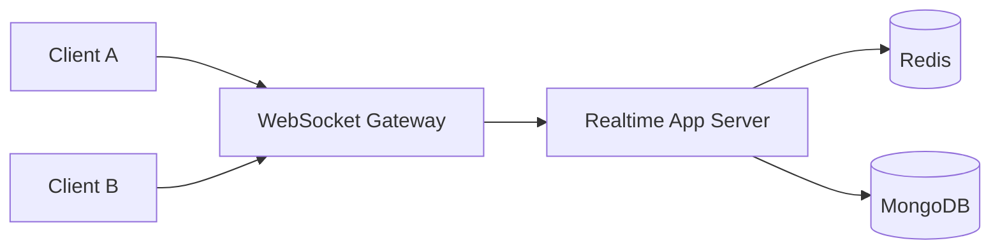

## Problem

I wanted to build a collaborative product where users could join shared spaces and interact in real time without lag spikes or state drift.

## Approach

- Designed a websocket event contract for movement, room joins, element updates, and presence.
- Split the codebase into reusable packages using a Turbo monorepo setup.
- Added Redis for caching and coordination to keep hot-path reads low latency.

## Architecture

## Key decisions

- Used event-level validation before broadcasting to avoid inconsistent state.
- Added rate-limiting on high-frequency events to reduce noisy clients.
- Kept room-scoped broadcasts instead of global fan-out for scale efficiency.

## Outcomes

- Delivered responsive multi-user interactions with stable state updates.
- Built a foundation that can support richer game-like mechanics and moderation features.

## What I would improve next

- Move to dedicated room shards for very large rooms.
- Add replay/debug tooling for websocket event traces.
- Introduce automated load testing for concurrent movement spikes.

