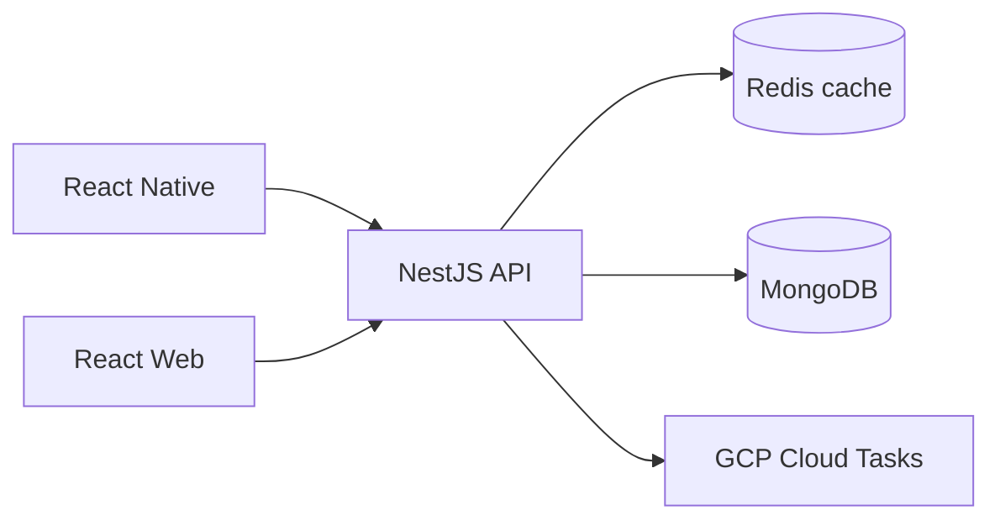

## Problem

The product needed a reliable task workflow with low-latency APIs and strong usage adoption, while also handling growing background job volume.

## Approach

- Built task creation, assignment, and state transitions across backend and frontend.
- Introduced batching and multi-layer caching for heavy reads.
- Migrated background jobs from Agenda to GCP Cloud Tasks for more predictable retries.

## Architecture

## Key decisions

- Focused first on response-time bottlenecks before feature expansion.
- Used instrumentation on critical endpoints to validate improvement decisions.
- Migrated job infrastructure in phases to avoid production regressions.

## Outcomes

- Delivered strong product adoption quickly after release.
- Reduced API tail latency and improved overall user experience.
- Increased reliability of async workflows under higher throughput.

## What I would improve next

- Add stricter SLOs and alerting on queue processing latency.
- Build self-serve dashboards for task workflow health.
- Introduce contract tests for external integrations.

