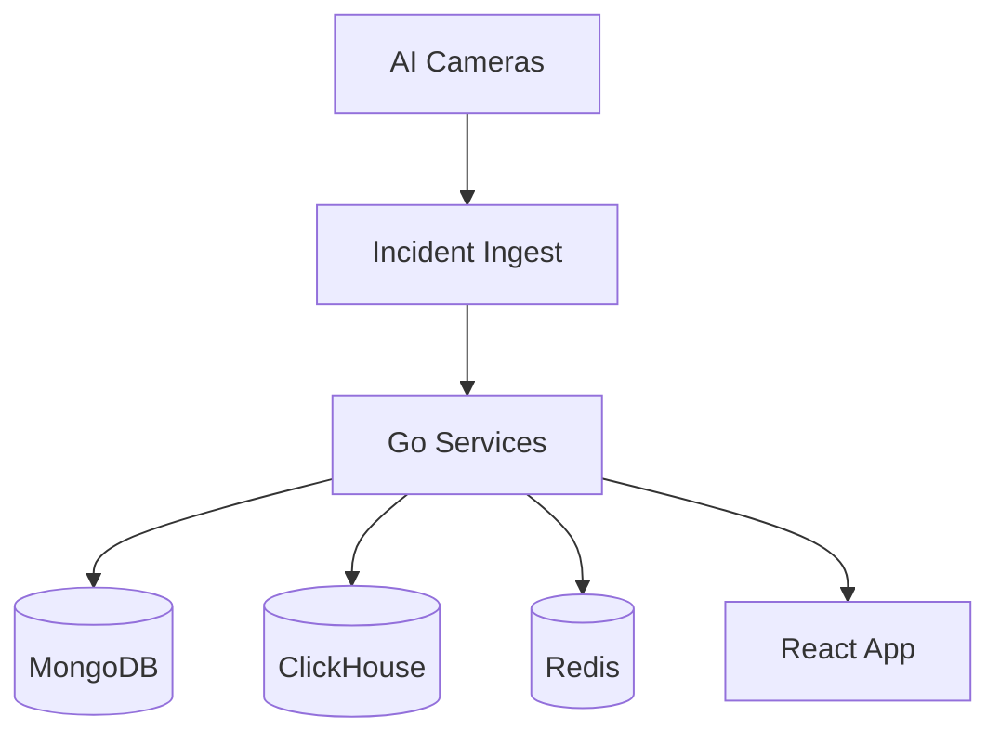

## Problem

Enterprise customers needed a unified way to review incidents, tune model behavior, and operate camera fleets with clear analytics and quick alerts.

## Approach

- Built incident review workflows across frontend and backend.
- Added no-code rule configuration for non-technical operators.
- Developed ClickHouse analytics views (graph/table/aggregation) for operational visibility.
- Collaborated with ML teams to integrate model and VLM-related product flows.

## Architecture

## Key decisions

- Prioritized fast alerting and operator usability over feature breadth.
- Separated operational analytics (ClickHouse) from transactional records (MongoDB).
- Kept backend flows explicit to support enterprise reliability requirements.

## Outcomes

- Enabled teams to manage incidents and camera behavior from one place.
- Improved response times through near-real-time alerting workflows.
- Delivered multi-view analytics for faster decision-making.

## What I would improve next

- Expand incident automation with confidence-based action rules.
- Add anomaly-detection overlays for proactive incident triage.
- Introduce data quality checks in ingestion to reduce noisy events.

