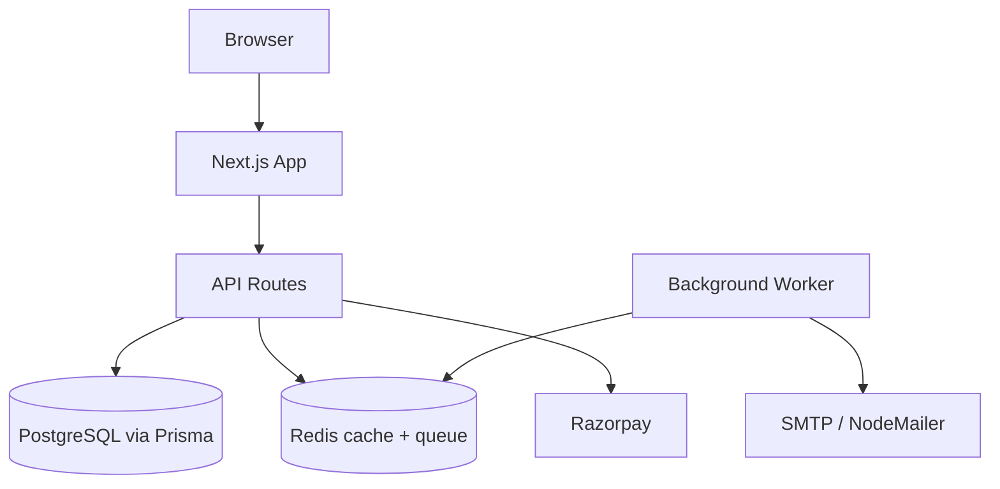

## Problem

Most portfolios are static and do not show full-stack execution. I wanted mine to demonstrate product engineering depth, not just visual polish.

## Approach

- Added authentication flows using NextAuth (credentials + OAuth).
- Implemented hire-request workflows with monthly caps and notification emails.
- Integrated Razorpay order creation, verification, and webhook handling.
- Added Redis-backed caching and queue processing for performance and reliability.

## Architecture

## Key decisions

- Chose App Router + server components where possible for performance.
- Used Redis as a shared primitive for both caching and background tasks.
- Stored payment status transitions explicitly to keep reconciliation simple.

## Outcomes

- Portfolio now behaves like a real SaaS slice with secure flows and operational controls.
- Supports a complete recruiter journey from discovery to contact/payment.

## What I would improve next

- Add end-to-end test coverage for payment and webhook flow.
- Add an admin dashboard for hire-request triage and response tracking.
- Add stronger observability around webhook retries and queue latency.

